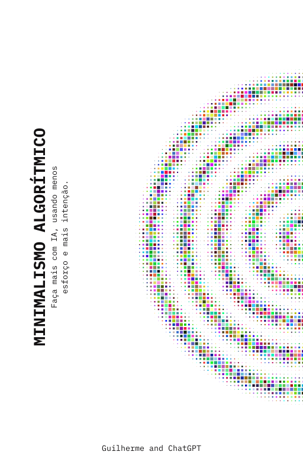

# Desafio de Projeto Bootcamp DIO: Criando um eBook com Inteligência Artificial

---

    

# Sobre o eBook

Este projeto tem como objetivo a criação de um eBook utilizando ferramentas de Inteligência Artificial para geração de conteúdo textual e visual. Todos os prompts utilizados estão documentados neste repositório.

> ℹ️ **Nota:** O conteúdo foi gerado com o auxílio de IAs, podendo conter imprecisões. A curadoria e diagramação foram feitas manualmente.

📕 [Clique aqui para ler o eBook](./assets/ebook-minimalismo.pdf)

---

## Tecnologias Utilizadas

* [ChatGPT](https://chat.openai.com/) — Geração de conteúdo textual
* [Canva](https://www.canva.com/) — Diagramação e edição visual

---

## Prompts Utilizados

### **ChatGPT** – Títulos e Conteúdo:

|   Ação   | Prompt                                                                                                                                                                                                                                                                         |
| :------: | ------------------------------------------------------------------------------------------------------------------------------------------------------------------------------------------------------------------------------------------------------------------------------ |
|  Título  | Crie títulos épicos com a temática minimalista criativa para um ebook sobre o uso da inteligência artificial e como podemos saber como usá-las                                                       |                                                    |
| Conteúdo | Título: Minimalismo Algorítmico. Crie um conteúdo para ebook, com foco em boas práticas, listando os pilares para criar um design que gere uma ótima experiência ao usuário. Regras: Explique sempre de maneira simples, deixe o texto enxuto, sempre traga exemplos em contextos reais e sempre deixe um título sugestivo por tópico |
| Conteúdo | Agora poderia detalhar cada tópico citado anteriormente? uma vez que cada um será um capítulo |                                                                                    |

---

## Funcionalidades

* Textos criados com auxílio do ChatGPT
* Imagens geradas por LeonardoAI, editadas no Canva
* Ilustrações criadas via prompts no LexicaArt
* eBook final diagramado manualmente

---

## Materiais

* Todos os prompts e imagens estão documentados neste repositório
* O eBook final está na pasta `/assets`

---

## Autor(a)

    <a href="https://github.com/GuilhermexL">GitHub</a>&nbsp;|&nbsp;
    <a href="https://www.linkedin.com/in/guilhermee-santos/">LinkedIn</a>

